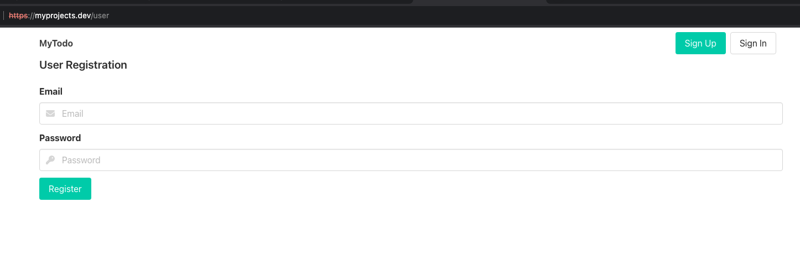
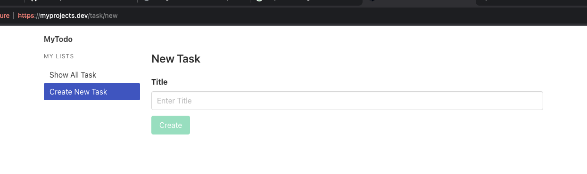
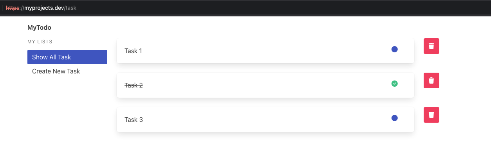
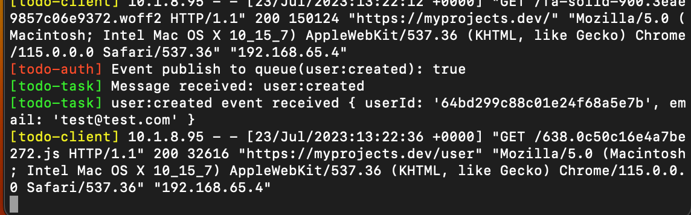
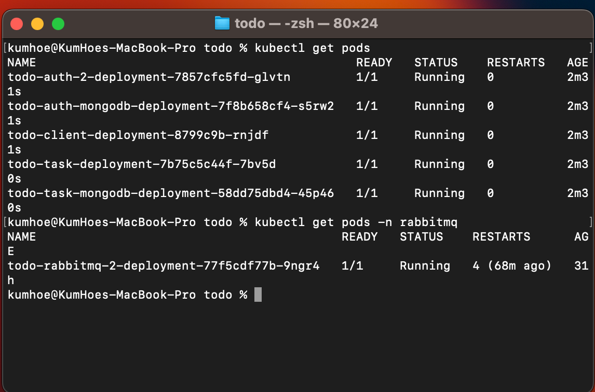

# Simple Todo App using Microservices in K8s

This project showcase the Todo Apps using microservices

## Description

This project consists of two NodeJS microservices, mainly, auth and task service to handle the backend tasks such as user registration, authentication and task creation. Additionally, the project also consist a frontend app run using Angular 16.

The project also implement Event Based communication using RabbitMQ.

All the apps (services, frontend, RabbitMQ) are running on top of Kurbenetes.

## Requisite

1. NodeJS
2. Angular 16
3. RabbitMQ
4. Kurbenetes

### Screen Capture

- Front End
  
  
  

- Event Communication Between Auth and Task Service
  

- Apps Run in K8s
  
